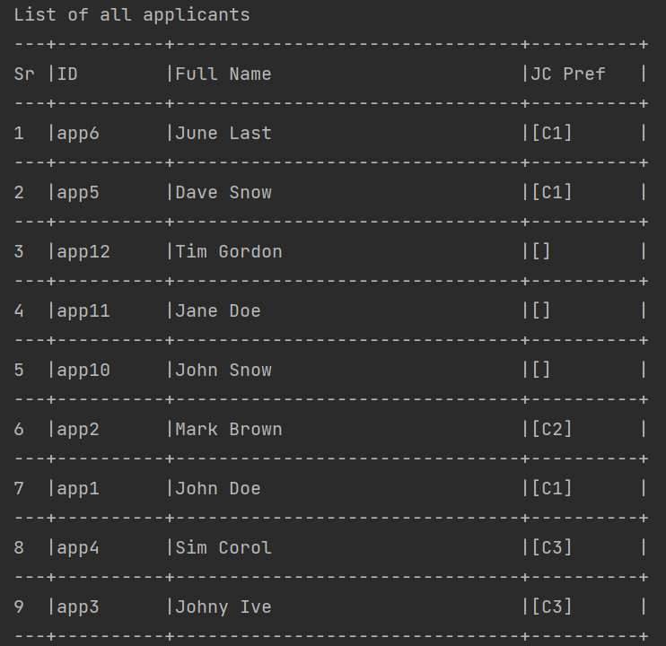
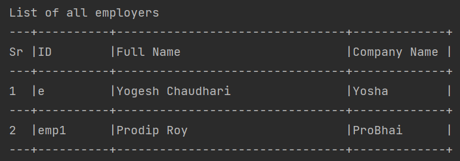
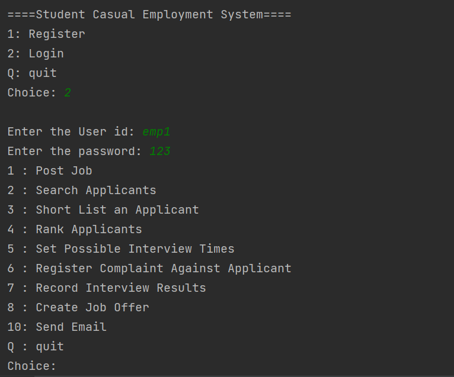

#Student Casual Employement System
A system to allow students to specify their availability and skills for casual employment while allowing employers to select and offer jobs to suitable applicants.

# Images

List of applicants in the system

List of Employers in the system

Employer Login and Menu

##Project Scope

- Registration of student applicant accounts.
- Registration of employer accounts.
- Creation and updating of job preference and availability.
- Adding and updating Employment Records and References by applicants
- Uploading of CVs (text files) by applicants.
- Searching for suitable applicants by employers based on job preference and availability.
- Shortlisting and Ranking candidates by employers based on availability, experience and CV
- Automatic email notification of inviting suitable interview times to highly ranked candidates
- Selecting interview times by shortlisted candidates.
- Updating candidate based on interview and reference check.
- Creation of job offers outlining employment details and notification by emails.
- Accepting or rejecting job offers by applicants.
- Complaints about applicants by employers and about employers by applicants.
- Blacklisting of applicants. 
